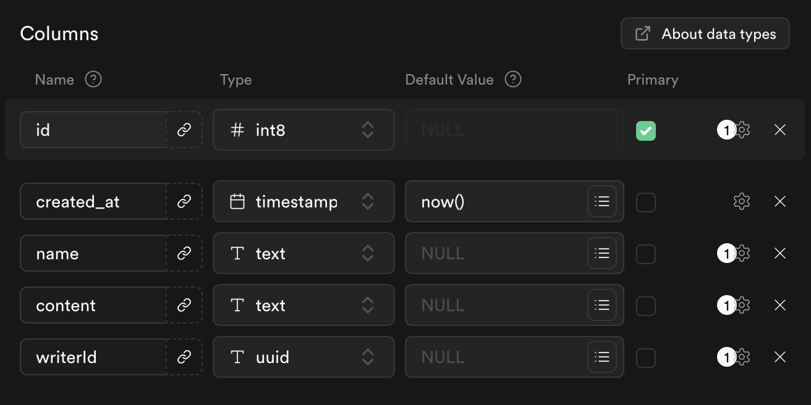

# crud_with_supabase

Create Flutter CRUD Board with Supabase (feat. 2nd IGNIGHT, CodeFactory)

## Getting Started

#### Install Flutter (3.24.4)
https://flutter.dev

#### Need Dependencies (Flutter)
- dependencies
    -  riverpod 2.6.0
    - go_router 14.3
    - supabase_flutter: 2.8.0
    - riverpod_annotation: 2.6.0
    - logger 2.4.0

- dev_dependencies
    - riverpod_lint 2.6.1
    - custom_lint 0.6.8
    - riverpod_generator 2.4.3

#### Install Supabase CLI
https://supabase.com/docs/guides/local-development/cli/getting-started

#### Deploy Supabase Edge Function

#### Create Supabase Database Boards Table

#### Run build_runner (for Riverpod Generator)
